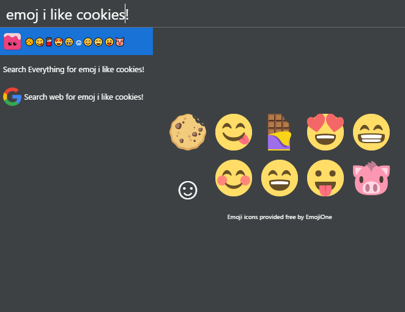

# cerebro-emojione

> [Cerebro](http://www.cerebroapp.com) plugin to find relevant emoji from text.  
Forked from [cerebro-emoj](https://github.com/KELiON/cerebro-emoj), but uses [EmojiOne](https://emojione.com) instead of your OS native emoji

Uses the API from this great article on [Emoji & Deep Learning](http://getdango.com/emoji-and-deep-learning.html). 
Check out the [Dango app](http://getdango.com) if you want something like this on your phone.

## Usage

In Cerebro, type `emoj` or `emoji` and some text, to find relevant emoji.

Use <kbd>cmd+c</kbd> to copy all emojis to clipboard or click on a certain one to copy only it.

## Related

- [Cerebro](http://github.com/KELiON/cerebro) – main repo for Cerebro app;
- [cerebro-emoj](https://github.com/KELiON/cerebro-emoj) – repo this plugin was forked from;
- [alfred-emoj](https://github.com/sindresorhus/alfred-emoj) – Original alfred plugin to find relevant emoji from text;
- [emoj](https://github.com/sindresorhus/emoj) - Find relevant emoji from text on the command-line.

## License

MIT © [Niels Maerten](http://niels.me)
